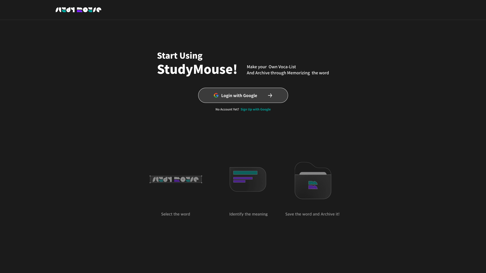
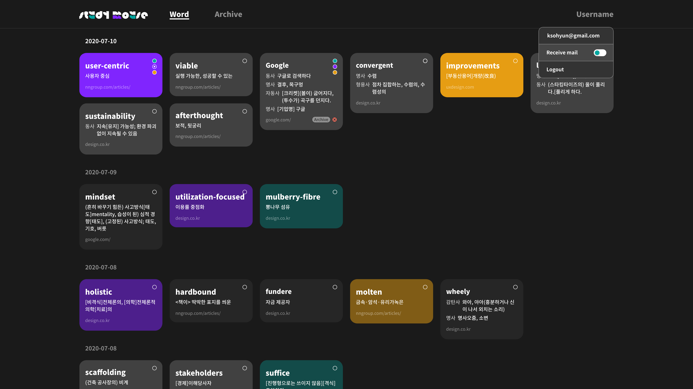
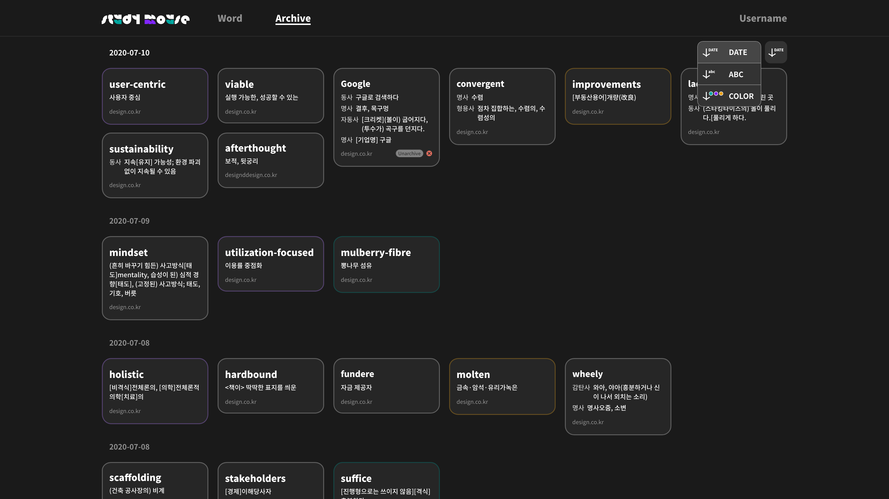

# StudyMouse Frontend

StudyMouse는 영어 단어 학습을 쉽고 빠르게 도와주는 단어장 웹 어플리케이션입니다. 크롬 익스텐션과 연동하여 사용합니다.

### UI

- **Login Page**
    
    - Google OAuth2.0 Login
    - gif/Lottie image



- **WordList Page**
    
    - Masonry Layout
    - Sorting by ABC/Date/Color
    - Archive/Delete WordItems
    - Color Change
     


- **Archive Page**



### 어플리케이션 실행 및 빌드
```
// 어플리케이션 실드행
git clone https://github.com/study-mouse/studymouse-client.git

npm install

npm run start

// 어플리케이션 빌드
docker build -t owen/studymouse-frontend .

docker run -p 80:80 -d owen/studymouse-frontend
```

### Language & Libraries

- JavaScript ES6
- React
- redux
- redux-saga
- styled-component
- axios
